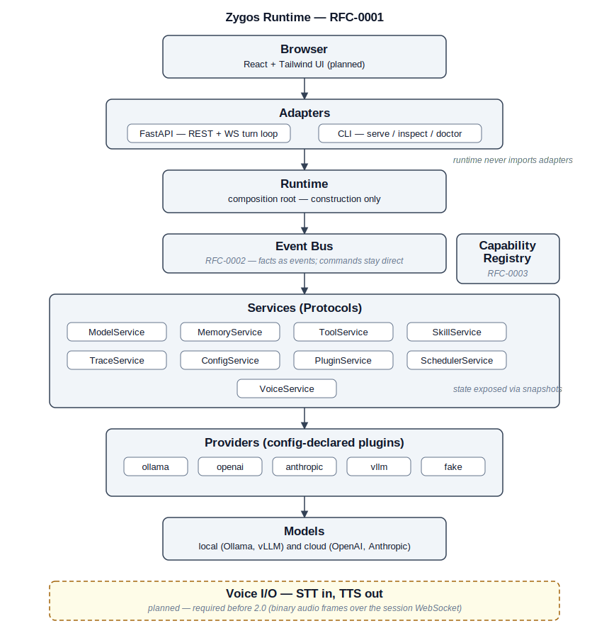

# Zygos Architecture

This document describes the v2 system design. Architectural decisions are recorded as
RFCs in [`docs/rfcs/`](./docs/rfcs/); the governing decision record for this design is
[RFC-0001: Service Architecture](./docs/rfcs/RFC-0001-Service-Architecture.md). The v1
TypeScript runtime, which v2 migrates from, is documented in
[Appendix A](#appendix-a--v1-reference-implementation).

---



## Layering

```
frontend (React + Tailwind + Vite)
        │  HTTP / WebSocket
backend/api        ── FastAPI adapter (REST + WS)
backend/cli        ── CLI adapter
        │  imports (one direction only)
backend/runtime    ── composition root, session loop, state objects
backend/services   ── service Protocols + default implementations
backend/plugins    ── config-declared implementations (providers, tools, voice…)
```

The dependency rule is strict and unidirectional: the runtime core (`runtime/`,
`services/`) imports nothing from `api/`, `cli/`, or any web framework. FastAPI never
appears below the adapter layer. Experience with v1 showed that convention alone is not
sufficient; the rule is therefore enforced mechanically by
`backend/tests/test_architecture.py` today, and will be supplemented by an
[import-linter](https://import-linter.readthedocs.io) contract in CI once
`zygos/api` exists. A failing build is the signal — not a code review comment.

---

## Services

Each service is defined as a `typing.Protocol` (structural interface) with one default
implementation. Consumers type against the Protocol only; no service imports another
service's concrete class. The nine service contracts are:

| Service | Contract (abridged) | Ports from v1 |
|---|---|---|
| `ModelService` | `classify_task`, `select_model`, `generate`, `stream` | provider router, protocol adapters |
| `MemoryService` | `store`, `retrieve`, `search`, `summarize` | context manager/storage/compaction (layered: working, episodic, semantic, procedural) |
| `ToolService` | `register`, `execute`, `execute_stream` | tool registry/executors, permissions, validation |
| `SkillService` | `discover`, `rank`, `execute`, `propose` | learning manager concepts |
| `TraceService` | `begin_trace`, `record_event`, `snapshot_state`, `finish_trace`, `reflect` | provider observability (extended) |
| `ConfigService` | `load`, `validate`, `get` | config loader/schema (Pydantic) |
| `PluginService` | `resolve(kind, name) -> type` | — (new) |
| `SchedulerService` | `schedule`, `cancel`, `list` | — (interface only; implementation deferred to the scheduler and autonomy milestone) |
| `VoiceService` | `transcribe_stream(audio) -> text events`, `synthesize_stream(text) -> audio` | — (interface only; engines arrive in the voice RFC) |

`VoiceService` is defined from the start so that the transport and service layers are
voice-shaped before concrete STT/TTS engines are selected. Local-first engines
(Whisper-family for transcription, Piper/Kokoro-class for synthesis) with optional cloud
fallbacks are scoped in the dedicated voice RFC.

---

## Wiring

All services take their dependencies as constructor parameters typed against Protocols.
There is no DI framework and no service locator — plain constructors keep the wiring
inspectable and testable.

One module, `backend/zygos/runtime/bootstrap.py`, is the composition root. It reads
validated Pydantic config, resolves plugin classes via `backend/zygos/plugins/resolver.py`,
and assembles the object graph. It is the only module permitted to construct concrete
service implementations. Any logic beyond construction and connection is a
review-blocking smell.

Plugins are **config-declared**: the config file maps a plugin kind and name to a
fully-qualified module path. For example:

```yaml
providers:
  ollama: "zygos_plugins.providers.ollama:OllamaProvider"
```

Reading the config tells you exactly what code runs. Nothing auto-activates from the
filesystem or installed entry points. Entry-point discovery is deliberately deferred to
the community-ecosystem milestone and its RFC, after a community exists to need it.

---

## Runtime Lifecycle

Every run of the runtime moves through the same fixed sequence of stages. The
lifecycle is the backbone the milestones fill in: stages never reorder, they
only gain implementations.

```
Bootstrap
  → Load Configuration
  → Resolve Plugins
  → Initialize Services
  → Register Capabilities
  → Load Skills
  → Load Memory
  → Start Scheduler
  → Accept Requests
  → Execute
  → Graceful Shutdown
```

| Stage | Status |
|---|---|
| Bootstrap | Implemented — `backend/zygos/runtime/bootstrap.py` (M1) |
| Load Configuration | Implemented — Pydantic schema + loader (M1) |
| Resolve Plugins | Implemented — config-declared resolver (M1, [ADR-0003](./docs/adr/ADR-0003-config-declared-plugins.md)) |
| Initialize Services | Implemented — constructor injection at the composition root (M1, [ADR-0002](./docs/adr/ADR-0002-constructor-injection.md)) |
| Register Capabilities | Planned — design pending [RFC-0003](./docs/rfcs/README.md#index) |
| Load Skills | Planned — M6 (`SkillService`) |
| Load Memory | Planned — M4 (`MemoryService`) |
| Start Scheduler | Planned — scheduler & autonomy milestone |
| Accept Requests | Planned — M8 (FastAPI adapter + WebSocket) |
| Execute | Planned — session loop and services fill in across M2–M7 |
| Graceful Shutdown | Planned — reverse-order teardown |

One deliberate naming choice: the stage is **Resolve Plugins**, not "Discover
Plugins". Zygos loads exactly the plugins declared in configuration and never
scans the filesystem or installed packages for code
([ADR-0003](./docs/adr/ADR-0003-config-declared-plugins.md)). Detecting the
environment at install time, or reading user files as data at run time, is
unaffected — code is declared; data is discovered.

Graceful shutdown tears the stack down in reverse order. The guarantee the
[Tool Contract](#tool-contract) makes per-tool — `cleanup` always runs — applies
to the runtime as a whole.

---

## State and Introspection

All runtime state that v1 kept as hidden private fields becomes named, snapshotable
objects in v2:

- `RouterState` — per-route circuit-breaker status, rate-limit windows.
- `SessionState` — message history (typed, immutable Pydantic models), pending events.
- `ReasoningState` — RDT iteration history, confidence trajectory.

Each object is registered with `TraceService` and exposed via
`TraceService.snapshot_state()`. This is the data source the Introspection Console and
the test suite both read. The principle is direct: **state the console cannot see is an
architecture bug**.

---

## Tool Contract

Tools implement a four-phase Protocol. Only `execute` is mandatory; the other three
phases default to no-ops, so trivial tools carry zero boilerplate.

```python
class Tool(Protocol):
    meta: ToolMeta
    def prepare(self, ctx: ToolContext) -> None: ...        # optional; default no-op
    async def execute(self, input: BaseModel, ctx: ToolContext) -> Any: ...  # required
    def verify(self, output: Any, ctx: ToolContext) -> VerifyResult: ...
        # optional; default = output-schema validation
    def cleanup(self, ctx: ToolContext) -> None: ...        # optional; default no-op
```

The executor guarantees that `cleanup` runs whether or not `execute` or `verify`
raised — `finally` semantics. This formalizes the guarantee v1 had to hand-roll for
A/B-test rollback. `verify` failures produce a failed `ToolResult`; a malformed output
is never silently accepted. v1 semantics for retry policy, timeouts, permission checks,
streaming execution, and one-level fallback tools are preserved.

---

## API Surface

REST handles request/response resources: sessions, config, skills, plans, proposals.

Each session has one multiplexed WebSocket at `/ws/session/{id}`. All real-time traffic
flows over that single connection:

- **JSON frames** — structured as `{channel, type, payload}` on channels `chat`,
  `tools`, `trace`, and `control`.
- **Binary frames** — prefixed with a 1-byte channel tag for `audio.in` and `audio.out`
  (PCM or Opus; codec negotiated in a `control` handshake).
- **Barge-in** — a `control` frame that cancels in-flight TTS synthesis. Because both
  the text and audio channels share one socket, barge-in requires no cross-socket
  coordination.

One connection means one auth handshake and no cross-socket ordering problems — a
property that matters on self-hosted, single-user deployments.

---

## Errors and Messages

A unified `ZygosError` exception hierarchy carries a stable, machine-readable error-code
taxonomy ported from v1 (e.g. `tool_timeout`, `tool_permission_denied`). Adapters map
`ZygosError` to HTTP status codes or WebSocket error frames; the runtime never raises
bare exceptions across a service boundary.

Session messages are typed, immutable Pydantic models. Tool results are structured
members of the message union — never JSON strings spliced into content. The v1 defect
class where `engine.ts:282` serialized tool results into free-text content is
unrepresentable in the v2 type system.

---

## Deployment

Zygos is a self-hosted web application. The intended targets are a user's own machine
and droplet-class cloud VMs. There is no Electron wrapper and no managed-platform
assumption. A single install command verifies Python, creates a virtual environment,
installs dependencies, builds the frontend, initialises the database, and launches the
server.

---

## Current Implementation Status

Milestone 1 is complete as of 2026-07-03: the Pydantic config schema and loader
(`backend/zygos/config/`), config-declared plugin resolver
(`backend/zygos/plugins/resolver.py`), composition root
(`backend/zygos/runtime/bootstrap.py`), architecture guard
(`backend/tests/test_architecture.py`), and CI are all in place with 28 tests passing.
See [ROADMAP.md](./ROADMAP.md) for the full milestone plan.

---

## Appendix A — v1 Reference Implementation

The v1 TypeScript runtime is frozen (Stage 0: bugfixes only). It is the reference the
Python migration ports from; concepts that worked are preserved, structural problems
identified in the v1 review are fixed. Six subsystems make up the frozen runtime:

**Providers + router + protocol adapters** (`src/providers/`). Model routing with
Ollama, OpenAI, Anthropic, and vLLM backends; per-route credential validation;
observability metrics including `RdtMetrics`. Protocol adapters normalise
provider-specific request/response shapes. The v2 counterpart is `ModelService`.
See [docs/v1/PROVIDER_HARDENING.md](./docs/v1/PROVIDER_HARDENING.md).

**RDT runtime** (`src/reasoning/`). Prompt-orchestration layer implementing a
Prelude → Recurrent → Coda reasoning pipeline, confidence gating (coherence,
completeness, consistency metrics), adaptive compute heuristics, and attention mode
control. Operates entirely above the model API — no access to model internals required.
The v2 counterpart is `ReasoningState` and the RDT milestone (M3).
See [docs/v1/RDT_REASONING_GUIDE.md](./docs/v1/RDT_REASONING_GUIDE.md).

**Context management** (`src/context/`). Layered memory with SQLite in WAL mode and an
FTS5 full-text index. Modules cover persistent storage (`storage.ts`), orchestration
(`manager.ts`), token budgeting and hard-limit enforcement (`budget.ts`), compaction and
summarisation (`compaction.ts`), and FTS5 retrieval (`search.ts`). The v2 counterpart is
`MemoryService`.
See [docs/v1/CONTEXT_MANAGEMENT_GUIDE.md](./docs/v1/CONTEXT_MANAGEMENT_GUIDE.md).

**Tool framework** (`src/tools/`). Tool registry, permission checks, retry policy,
timeouts, and streaming execution. The A/B-test incident — where a hand-rolled
`try/finally` was needed to restore the live registry — directly motivated the four-phase
`prepare/execute/verify/cleanup` contract in v2.
See [docs/v1/TOOL_DEVELOPMENT_GUIDE.md](./docs/v1/TOOL_DEVELOPMENT_GUIDE.md).

**Learning system** (`src/learning/`). Observation collection, proposal generation,
A/B testing against sandboxed tool candidates, approval workflows, version history, and
audit logging. Ships with `approval_mode: manual` and `auto_apply_low_risk: false` as the
only defaults — self-improvement is never autonomous. The v2 counterpart is `SkillService`.
See [docs/v1/LEARNING_SYSTEM_GUIDE.md](./docs/v1/LEARNING_SYSTEM_GUIDE.md).

**Interviewer** (`src/interviewer/`). Multi-turn requirements-gathering sessions with
adaptive follow-up questions, complexity-gated build-request interception, and
transcript-to-plan conversion (requirements, constraints, risks, effort estimation, phase
roadmap). Persisted to SQLite; exportable as JSON or Markdown. Ports to v2 as an
interviewer workflow plugin.
See [docs/v1/INTERVIEWER_WORKFLOW_GUIDE.md](./docs/v1/INTERVIEWER_WORKFLOW_GUIDE.md).
